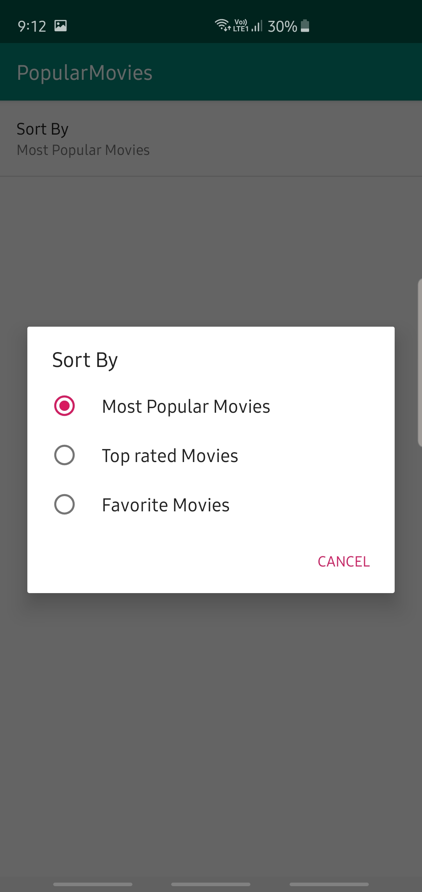
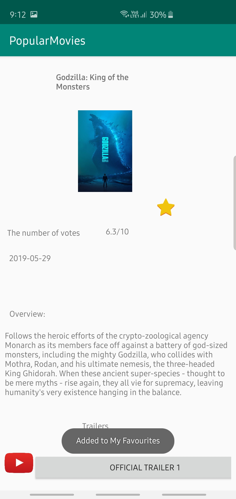

<h2>Movies Application </h2>

  

  
  

   
  
 

  
  
  

  
  
 

Here is a fully functional and colorful android app which I made from scratch for Android Developer Nanodegree program. This app reveals the power of adaptive UI both for phone and tablet devices.

With the app, you can:
  <ul>
  <li>  Discover the most popular, the most rated or the highest rated movies</li>
  <li>  Save favorite movies locally to view them even when offline</li>
  <li>  Watch trailers</li>
  <li>  Read reviews</li>
</ul>
How to Work with the Source

This app uses The Movie Database API to retrieve movies. You must provide your own API key in order to build the app.
